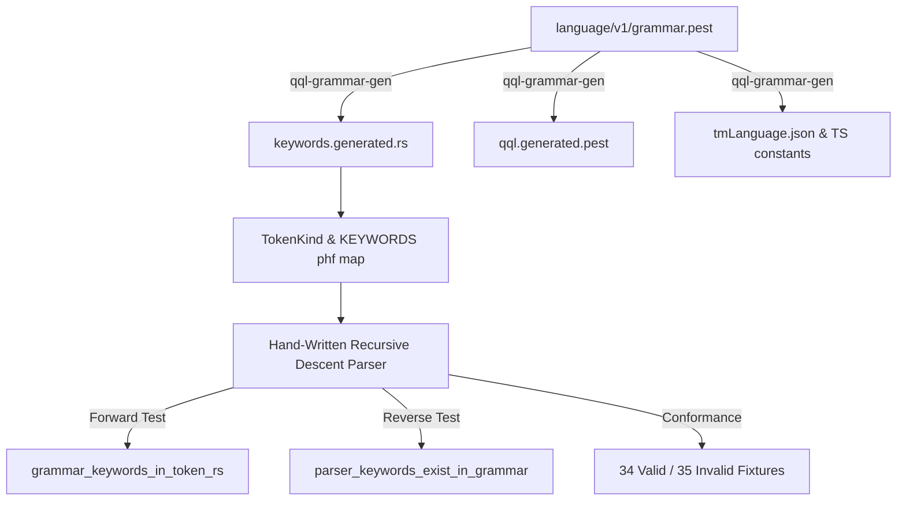

# Design Document: QQL Parser Generation & Alignment Roadmap

**Date:** 2026-07-31  
**Status:** Draft / Proposal  
**Target:** `crates/qql-core`  

---

## 1. Context & Problem Statement

`qql-core` is the core parser, AST, and query compiler for the QQL language. It is designed with strict performance and portability requirements:
- `no_std` compatible (usable in WebAssembly, embedded environments, and host runtimes).
- Zero external runtime dependencies for core parsing and AST lowering.
- Hand-written Pratt parsing for mathematical formulas and hand-written recursive descent for statement parsing.

The QQL language syntax specification is formally declared in `language/v1/grammar.pest`. 

Historically, hand-written recursive descent parsers risk **syntactic drift**:
1. **Forward Drift**: A keyword or rule added to `grammar.pest` is not recognized by the lexer/parser.
2. **Reverse Drift**: A string check or keyword accepted by the hand-written parser is missing from `grammar.pest`.

Through recent automated generation tooling (`qql-grammar-gen`), 5 derived artifacts are now automatically generated and validated in CI:
- `crates/qql-core/grammar/qql.generated.pest`
- `editors/vscode/syntaxes/qql.tmLanguage.json`
- `editors/vscode/src/keywords.generated.ts`
- `website/src/scripts/qql-keywords.generated.ts`
- `crates/qql-core/src/keywords.generated.rs` (Rust PHF map)

This document evaluates the options and migration path for generating or validating the parser itself directly from `grammar.pest`.

---

## 2. Technical Requirements

Any solution for parser generation or parser alignment must satisfy the following constraints:

1. **`no_std` Compatibility**: Must compile with `#![no_std]` when default features are disabled.
2. **Zero Dependencies**: Must not introduce runtime dependencies (such as heavy parser generator runtime crates) to `qql-core`.
3. **AST Parity & Performance**: Zero-allocation token matching and deterministic error spans.
4. **100% Conformance**: Must pass all 34 valid fixture groups and 35 invalid test cases in `language/v1/fixtures`.

---

## 3. Evaluation of Parser Generation Options

### Option A: `pest` / `pest_derive`
- **Mechanism**: Use `pest` as the runtime parser engine by compiling `grammar.pest` into a parser struct.
- **Pros**: 100% grammar alignment by definition; no manual recursive descent maintenance.
- **Cons**:
  - `pest` requires `std` and allocator abstractions that complicate pure `no_std` environments.
  - Adds heavy dependencies (`pest`, `pest_derive`, `ucd-trie`).
  - Pest produces a concrete parse tree (CST) that requires a second pass to lower into the `qql-core` AST, increasing parse overhead.
- **Verdict**: Rejected due to `no_std` and dependency constraints.

### Option B: `LALRPOP` or `winnow` / `chumsky`
- **Mechanism**: Rewrite `grammar.pest` or generate a parser definition for LALRPOP/winnow.
- **Pros**: Fast, strongly typed parser generation.
- **Cons**:
  - Requires maintaining two grammar definitions (Pest PEG for spec/docs and LALRPOP/winnow for Rust).
  - High risk of specification divergence between PEG and LR(1)/combinator grammars.
- **Verdict**: Rejected due to dual-grammar maintenance overhead.

### Option C: Custom Table/Code Generator in `qql-grammar-gen`
- **Mechanism**: Expand `qql-grammar-gen` to parse `grammar.pest` AST and emit a generated Rust recursive descent parser or state table into `crates/qql-core/src/parser.generated.rs`.
- **Pros**:
  - 100% `no_std` and zero dependencies.
  - Complete alignment between `grammar.pest` and generated parser.
- **Cons**:
  - Building a full PEG-to-Rust recursive descent generator is significant engineering effort (~2,000+ lines of generator code).
  - Special handling required for Pratt parsing of formula expressions (`FORMULA …`).
- **Verdict**: Feasible long-term architecture, but requires phased implementation.

### Option D: Hybrid Generated Lexer + Bi-Directional CI Validation (Current / Recommended)
- **Mechanism**: 
  1. Automatically generate the keyword map (`keywords.generated.rs`) from `grammar.pest`. Adding a keyword without updating `TokenKind` causes a compile error.
   2. Enforce **Forward-Drift Test**: Asserts all 165 keywords in `grammar.pest` exist in `keywords.generated.rs`.
  3. Enforce **Reverse-Drift Test**: Statically scans `crates/qql-core/src/parser/` for `ascii_equal`, `peek_word`, `expect_word`, `eq_ignore_ascii_case` calls and asserts every referenced keyword is declared in `grammar.pest`.
  4. Enforce **Exhaustive Conformance Corpus**: CI validates all valid statements and invalid cases against canonical AST snapshots.
- **Pros**:
  - Zero runtime overhead, 100% `no_std` and zero dependencies preserved.
  - Immediately closes 100% of forward and reverse drift bugs.
  - Zero extra complexity in build scripts.
- **Verdict**: Recommended architecture for QQL 1.x.

---

## 4. Migration & Alignment Roadmap

### Phase 1: Generated Lexer & Bi-Directional Gates (Completed)
- Render `keywords.generated.rs` via `qql-grammar-gen`.
- Enforce `parser_keywords_exist_in_grammar` reverse-drift unit test in `crates/qql-core`.
- Wire all 5 derived artifacts into `qql-grammar-gen check` in CI.

### Phase 2: AST Node Annotation (Next Release)
- Annotate grammar rules in `grammar.pest` with explicit AST node attributes (e.g. `@ast(QueryExpr::Nearest)`).
- Validate AST node names against `qql_core::ast::Stmt` variants during `qql-grammar-gen check`.

### Phase 3: Full PEG-to-Rust Generator (Future Major Version)
- Implement AST-driven PEG generator in `qql-grammar-gen` for standard statement clauses.
- Keep Pratt parser for mathematical formula expressions.
